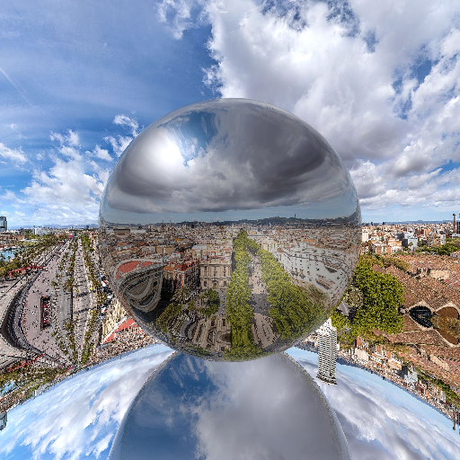

# RayTracer
Elijah Richards

Custom  Built Raytracer from scratch

This software was built 100% by Elijah Richards, from scratch. Each line of code was written by me, by hand. 
It takes a text file and creates a PPM file rendering that scene using the phong illumination model and backwards raytracing.
An example image of what can be created is shown below.



# Building and Running

To build and run the software type the following into bash
```
make
./raytracer_app ./TestImages/transparency.txt
```
This will generate a ppm file with the same name.

# Input Files
Input files take many different types of arguments.

## Scene Parameters

  These Parameters define the scene and how it is rendered. These definitions should only be defined once.
  If defined more than once the most recent declaration will be used.
    
    - imsize int:width int:height
      Defines the image size in pixels using two integers 

    - eye double:x double:y double:z
      Defines the eye location to render the scene

    - viewdir double:x double:y double:z
      Defines the direction the scene is rendered from

    - updir double:x double:y double:z
      Defines the up direction to view the scene with.

    - vfov double:vfov or fov double:vfov
      Defines the vertical fov to use when rendering

    - bkgcolor double:r double:g double:b
      Defines the color of the background


## Object Parameters

  These Parameters are used to define objects in the scene
    
    - mtlcolor double:r double:g double:b
      Defines the color of any objects following this definition with a flat, unshaded color

    - mtlcolor double:r double:g double:b double:rs double:gs double:bs double:ka double:kd double:ks double:n
      Defines the color of any objects following this definition with phong illumitation shading
        - double:r double:g double:b
          The base color of the object
        - double:rs double:gs double:bs
          The color of the specular highlight
        - double:ka
          The amount of ambient light as defined by the phong illumitation equation (The brightness of the object when not illumitated by light)
        - double:kd
          The amount of diffuse light as defined by the phong illumitation equation (The brightness of light compared to shadow)
        - double:ks
          The amount of specular light as defined by the phong illumitation equation (The brightness of highlight)
        - double:n
          The specular exponent in the phong illumitation equation (The size of the hightlight)

    - mtlcolor double:r double:g double:b double:rs double:gs double:bs double:ka double:kd double:ks double:n double:alpha double:ref
      Defines the color of any objects following this definition with phong illumitation shading with transparency and index of refraction
        - double:r double:g double:b
          The base color of the object
        - double:rs double:gs double:bs
          The color of the specular highlight
        - double:ka
          The amount of ambient light as defined by the phong illumitation equation (The brightness of the object when not illumitated by light)
        - double:kd
          The amount of diffuse light as defined by the phong illumitation equation (The brightness of light compared to shadow)
        - double:ks
          The amount of specular light as defined by the phong illumitation equation (The brightness of highlight)
        - double:n
          The specular exponent in the phong illumitation equation (The size of the hightlight)
        - double:alpha
          Defines the transparency of the object (0 being transparent - 1 being opaque)
        - double:ref
          Defines the index of refraction, being how dense the object is. A vaccuum has an IoR of 1, air has ~1.00003 while water has ~1.3

    - texture string:name
      defines a texture file that any object after this may use to display a texture on the object.
      Phong illumitation is still used, but the object texture defines the base color instead of using the color provided by the mtlcolor.

    - sphere double:x double:y double:z double:r
      defines a sphere with the center at double:x double:y double:z and with a radius double:r

    - cylinder double:x double:y double:z double:vx double:vy double:vz double:r double:h
      defines a cylinder with a center, an up vector, a radius and a height
      IMPORTANT: cylinders do not currently have support for textures

### Triangle Parameters
    These parameters are used to define triangles in a scene and can be used to define entire meshes to make more complex objects

    - v double:x double:y double:z
      Defines a vertex in space that is used for defining triangles
    - vn double:x double:y double:z
      Defines a vector that is used to define vertex normals when defining a triangle with smooth shading
    - vt double:x double:y
      Defines a texture point that is used to define where a textured triangle should get it's texture.
      These always should go from 0-1 and should be in normalized UV cordinates
    - f int:v1 int:v2 int:v3
      Defines an untextured flat shaded triangle using the vertecies indexing from 1. For example if 3 vertecies are defined the face would
      be defined with:
      f 1 2 3
    - f int:v1/int:n1 int:v2/int:n2 int:v3/int:n3
      Defines a untextured smooth triangle using the vertex normals provided above. An example could be:
      f 1/1 2/3 4/4
    - f int:v1//int:t1 int:v2//int:t2 int:v3//int:t3
      Defines a flat textured triangle using the vertecies and uv texture coordinates provided above. An example could be:
      f 1//1 2//2 3//3
    - f int:v1/int:n1/int:t1 int:v2/int:n2/int:t2 int:v3/int:n3/int:t3
      Defines a smooth textured triangle using verticies, vertex normals and uv texture coordinates. An example could be:
      f 1/1/1 2/2/2 3/3/3

## Light Parameters
    These parameters are used to define light sources to light the scene 

        - light double:x double:y double:z int:type
          Two different types of light sources can be defined based on the int:type.
          If 0, a direction light is created, with double:x double:y double:z defining the direction the light is comming from.
          If 1, a point light is created, with double:x double:y double:z defining th origin of the light.
          Multiple light sources can be defined and they interact in the scene like one might expect.

# Limitations

This software was created in an Object Oriented programming style using lots of inheritence and polymorphism. This was done so that I could practice these
techniques however it comes at a price. Inheritence and polymorphism are not suited for graphics because the slowdown that these cause is very noticeable. 
As such, this code is very limited in how fast it runs and how many objects it can render in a reasonable time. In order to fix these problems the code would have to be rewritten in order to remove polymorphism and inheritence.